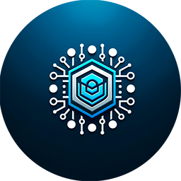
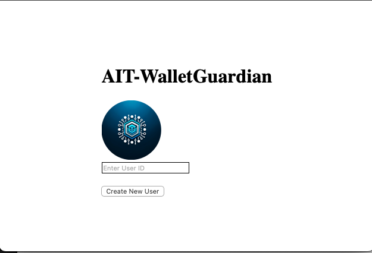

# AIT-WalletGuardian




AIT-WalletGuardian, a Vue.js app, integrates Circle's Web3 wallets for secure, easy crypto transactions, offering a user-friendly platform for seamless digital asset management.

## Inspiration
The inspiration for AIT-WalletGuardian came from the growing need for secure and user-friendly blockchain interactions. With the surge in digital assets' popularity, we recognized a gap in easy-to-use platforms that cater to both beginners and experienced users in the Web3 space.

## What it does
AIT-WalletGuardian integrates Circle's User-Controlled Wallets into a Vue.js application, enabling users to execute secure transactions across multiple blockchains. It simplifies in-app purchases, user-to-user, and app-to-user payments, providing a seamless and secure interface for managing digital assets.

## How we built it
We built AIT-WalletGuardian using the Vue.js framework, chosen for its reactivity and component-driven architecture. We integrated Circle's Web3 wallets using their RESTful APIs, allowing for flexible transaction options. The integration process involved extensive use of JavaScript and Vue's reactive capabilities to ensure a responsive user experience.

## Challenges we ran into
The main challenges included ensuring seamless integration of Circle's API into the Vue.js framework and maintaining a balance between user autonomy and security. We also faced hurdles in creating an intuitive UI/UX that catered to both beginners and experienced blockchain users.

## Accomplishments that we're proud of
We are proud of developing an application that strikes a balance between security and ease of use. Our platform stands out for its simplicity in managing complex blockchain transactions. The smooth integration of Circle's APIs into a Vue.js framework is also a significant accomplishment for our team.

## What we learned
Throughout this project, we deepened our understanding of blockchain technology, specifically in the context of Web3 applications. We also honed our skills in Vue.js and RESTful API integration, learning to overcome challenges in user interface design and API connectivity.

## What's next for AIT-WalletGuardian
Moving forward, we plan to expand AIT-WalletGuardian's capabilities by supporting more blockchains and introducing features like multi-signature wallets and advanced transaction tracking. Our goal is to make AIT-WalletGuardian a comprehensive tool for all digital asset management needs.



## Initial Setup

Before starting, make sure you have Node.js and Vue CLI installed on your system.

### Step 1: Create and Navigate into the Project Directory

Open your terminal or command prompt and run the following commands to create a new directory for your project and navigate into it:

```bash
mkdir AIT-WalletGuardian
cd AIT-WalletGuardian
```

### Step 2: Initialize Vue Project
Initialize a new Vue project within the directory:

```bash
✨  Creating project in /Users/xxx/MyLocalDocuments/go-projects/AIT-WalletGuardian/ait-walletguardian.
⚙️  Installing CLI plugins. This might take a while...

🚀  Invoking generators...
📦  Installing additional dependencies...

⚓  Running completion hooks...

📄  Generating README.md...

🎉  Successfully created project ait-walletguardian.
👉  Get started with the following commands:

 $ pnpm run serve
 ```

### Step 3: Project Structure

 AIT-WalletGuardian/ait-walletguardian on  main [!?] via  v21.5.0 on ☁️  

 ```bash
❯ tree -L 1
.
├── README.md
├── babel.config.js
├── jsconfig.json
├── node_modules
├── package.json
├── pnpm-lock.yaml
├── public
├── src
└── vue.config.js
 ```


 Step 4: Install Additional Dependencies
Install any necessary libraries, such as Axios for API requests:

```bash
pnpm install axios
```
